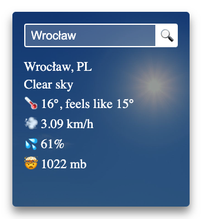

[](https://www.npmjs.com/package/@alyrik/react-city-weather-report-widget)

# React City Weather Report Widget

A simple React component showing current weather for given location.

It uses [OpenWeather API](https://openweathermap.org/api) to load weather data.

Check out live [DEMO](https://react-city-weather-report-widget.vercel.app/?path=/story/reactcityweatherreportwidget--vertical).



<!-- TOC -->

- [Prerequisites](#prerequisites)
- [Installation](#installation)
- [Usage](#usage)
- [Props](#props)
- [Development](#development)
- [Building](#building)

<!-- TOC -->

## Prerequisites

You are required to provide your own OpenWeather API key in order to make the widget work. You can obtain API key for
free by creating an account on [OpenWeather website](https://home.openweathermap.org/users/sign_in).

## Installation

```
npm install --save @alyrik/react-city-weather-report-widget
```

## Usage

Just place `<ReactCityWeatherReportWidget>` component anywhere in your app:

```tsx
import { ReactCityWeatherReportWidget } from '@alyrik/react-city-weather-report-widget';

function App() {
  return (
    <main>
      <ReactCityWeatherReportWidget
        apiKey="..."
        defaultCity="..."
      </<ReactCityWeatherReportWidget>
    </main>
  );
}
```

## Props

| Property          | Type                            | Required | Default      | Description                                                                                                                                                                                                  |
| ----------------- | ------------------------------- | -------- | ------------ | ------------------------------------------------------------------------------------------------------------------------------------------------------------------------------------------------------------ |
| `apiKey`          | `String`                        | true     | ---          | OpenWeather API key                                                                                                                                                                                          |
| `defaultCity`     | `String`                        | true     | ---          | Name of the city to be shown by default                                                                                                                                                                      |
| `refetchInterval` | `Number`                        | false    | `30000`      | Interval in `ms` for refetching current weather data.<br/> ⚠️ Don't make it less than 1000ms if you use free subscription otherwise it will abuse free limits and your API token will be temporarily blocked |
| `orientation`     | `'vertical'`<br/>`'horizontal'` | false    | `'vertical'` | Widget orientation                                                                                                                                                                                           |

## Development

- Clone this repo.
- `npm install`
- `npm run storybook`

## Building

```
npm install
npm run build
```
